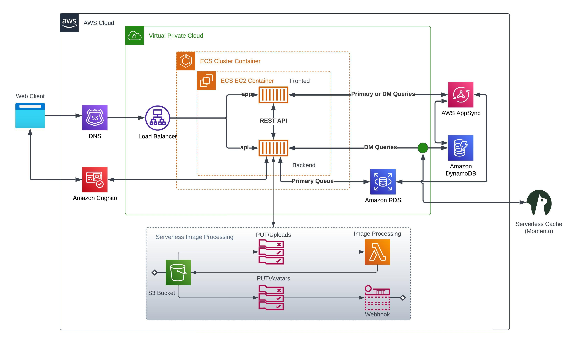
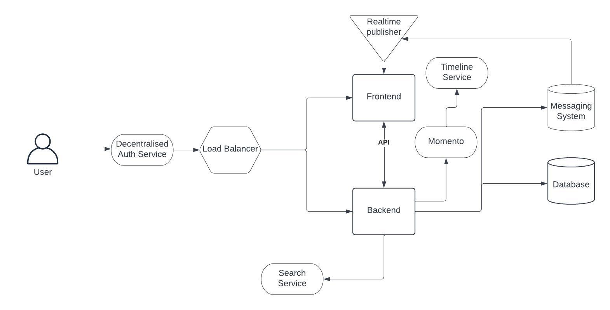

# Week 0 — Billing and Architecture

# Date: 11/02/2023

1. Participated in the live stream.

# Date: 13/02/2023

1. Watched the supplementary videos
2. Created the conceptual and logical diagrams
3. Mucked around with the AWS account and setup budgets and billing alerts.  This is an account I have had for a few years so some weird stuff may happen. Nice to see AWS have added organisations.

# Date: 14/02/2023

Below is the link to the diagram in lucidchart. I will also embed the image (when I figure out how I can do that which shouldn't be that hard).

[Logical diagram to cruddur](https://lucid.app/lucidchart/65b6dc04-0e1f-4f73-b03e-cb287b6826d8/edit?viewport_loc=-19%2C50%2C2134%2C1025%2C0_0&invitationId=inv_31699d85-2632-4cd4-8139-f232befed868)

# Date:17/02/2023

Not sure why, but for some reason it took a few days for the image to show up.  I am going to upload the conceptual diagram as well and hope this works.

Cruddur conceptual diagram (sorry no napkins!)

Deleted the previously created budget and billing alarms and set them up again using the aws cli.
